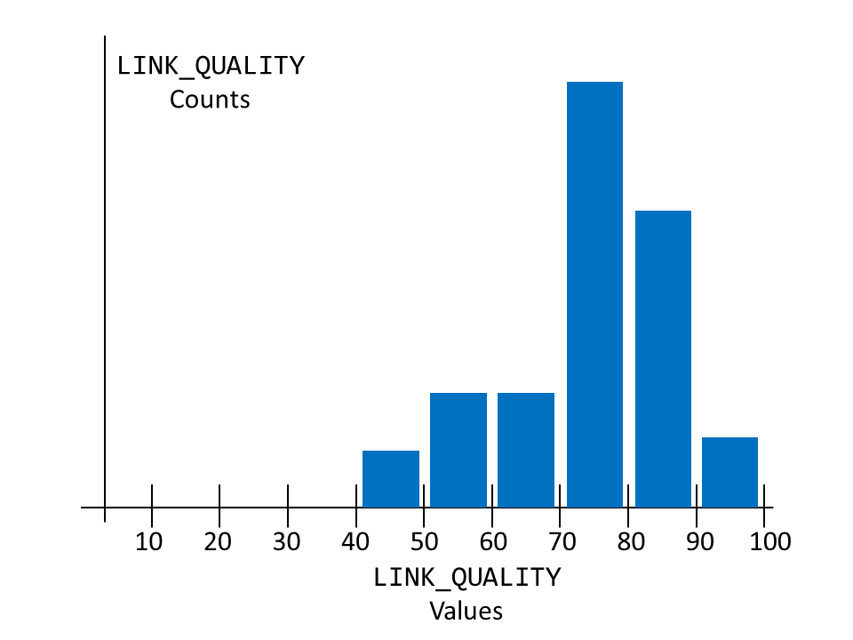
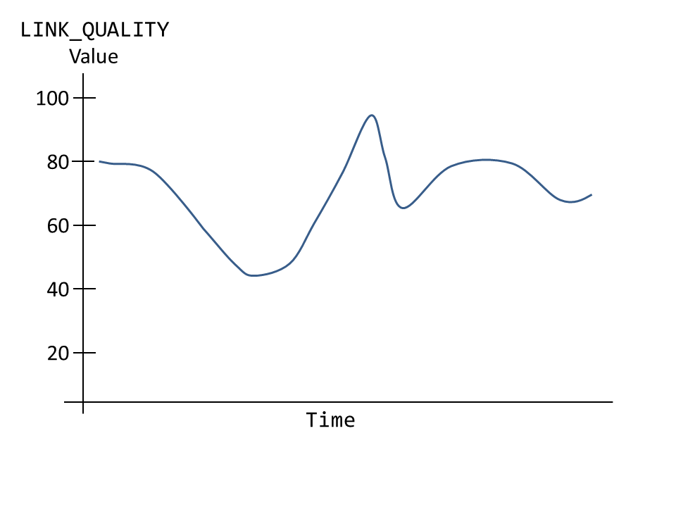

stat_log
========
NOTE: This project’s original home is
    https://github.com/rjmccabe3701/stat_log.git

stat_log is an extensible C++ library for logging and statistic collection. It's primary aim is to be efficient and configurable; It was designed with embedded systems applications in mind -- in particular, software-defined radio.

For the impatient, here is how you build the library:

Native build:
```bash
    mkdir build
    cd build
    cmake ../
    make
```
ARM cross compile:
```bash
    export SYSROOT_BASE=/path/to/arm_sysroot
    mkdir arm_build
    cd arm_build
    cmake  -DCMAKE_TOOLCHAIN_FILE=../arm_toolchain.cmake  ../
    make
```

The following is a list of design principles:

1. _The client code, i.e., the code responsible for generating statistics, should be agnostic to how the stats are visualized_.  This is desired for two reasons:
    1. To avoid cluttering the client code with unnecessary details.
    2. To allow the statistical representations to be modified without having to change client code.

   Suppose, for example, the client wants to record a value every time the link quality changes.  Further suppose this link
   quality takes value in the range [0,100].  The clients will simply call
    ```cpp
    stat_log::writeStat<LINK_QUALITY>(new_link_quality_value);
    ```
    and, depending on how the LINK_QUALITY statistic has been configured, the ```writeStat``` call could proxy to a variety      of statistic handlers.  For example, if LINK_QUALITY has been configured to be a simple status, when the statistic is        queried, it would simply return the latest value of the LINK_QUALITY that was recorded (with no history):
    ```cpp
    LINK_QUALITY: 55.5
    ```
    The LINK_QUALITY could also be configured to keep track of basic statistics, for example:
    ```cpp
    LINK_QUALITY:
    count    min     max     mean
    ------------------------------
    1021     42.2    97.2    72.5
    ```
    Perhaps a histogram is what is desired for LINK_QUALITY, in this case, a stat query may look something like:
    <p align="center">
        
    </p>
    
    An even more interesting example of a LINK_QUALITY statistic is a time-series graph:
    <p align="center">
        
    </p>
    
    See [Stats](doc/statistic_types.md) for a list of statistic types provided by the stat\_log library _and_ documentation      on how to create your own.
  
    The key point is that, in all of these examples, the client code's statistic generation call site need not change.
    It is, of course, desirable to have as much visibility into your running application as possible; we *could* configure
    all statistics to be of the "time-series" variety.  However, this could come at a cost of higher CPU/memory load.  During
    the debugging phase, the user may choose to configure the statistics to capture more information, while the released code
    would use simpler (lower overhead) stats -- and all that is required is a re-compile of the application software.
    
2.  _Seemless support for multi-dimensioned statistics._  In many cases a particular statistic type is associated with a
   dimension.  Going back to our LINK_QUALITY example, usually the software is interested in a *per-link* link quality.  It     would be unweildy for the user to have to do something like:
   ```cpp
   auto this_link_quality = getLinkQualityForNeighbor(nbr_num);
   if(nbr_num == 0)
       stat_log::writeStat<LINK_QUALITY_NBR0>(this_link_quality);
   else if (nbr_num == 1)
       stat_log::writeStat<LINK_QUALITY_NBR1>(this_link_quality);
    else if (nbr_num == 2)
       stat_log::writeStat<LINK_QUALITY_NBR2>(this_link_quality);
   //etc.
   ```
   We would much rather support this usage:
   ```cpp
   auto this_link_quality = getLinkQualityForNeighbor(nbr_num);
   stat_log::writeStat<LINK_QUALITY>(nbr_num, this_link_quality);
   ```
   Also, when the LINK_QUALITY statistic is queried, the value for each dimension will be displayed.  For example:
    ```cpp
    LINK_QUALITY:
    INDEX = 0:
    count    min     max     mean
    ------------------------------
    985     32.1    82.1    45.2
    
    INDEX = 1:
    count    min     max     mean
    ------------------------------
    775     74.2    95.7     85.2
    
    etc
    ```
3. _Support logging capability._   The application should be able to add a log entry by doing:
  ```cpp
  stat_log::logger<LINK_LAYER>(INFO) << "Received a HELLO message from nbr " << nbrId;
  ```
  Where ```LINK_LAYER``` is a logging tag which is used for the purpose of allowing granular displaying and filtering of
  logging messages.  This message will be stored and be made available for retrieval at a later time.  When retreived the log   entry may look something like:
  ```
  12:21:35.568309: LINK_LAYER: INFO: Received a HELLO message from nbr 5
  ```
  To avoid inundating the logging buffer, the logging messages should be filter-able by the logging tag (in this case
  "LINK_LAYER") *and* the logging level (in this case "INFO"). 
  
  Multiple logging buffers should be supported.  This is useful for radio software in which you want to provide both
  a log of software events *and* a hexdump of packets flowing through the radio.  And example of the hexdump generation code   would be:
  ```cpp
  stat_log::hexDumper<LINK_LAYER>(DEBUG).hexdump(buffer.begin(), buffer.size(), "HELLO Message");
  ```
  When retreived the hexdump entry may look something like:
  ```
  09:16:35.420350: LINK_LAYER: DEBUG: HELLO Message
  4f 24 00 80 53 00 00 00 fc fe 06 00 01 00 01 00 40 0a 47 14 a0 22 6a 14 40 48 90 14 80 93 dc 14
  00 00 01 00 00 0f 0f 00 62 0a 61 c3 63 1e 56 00 00 00 00 42 a1 03 00 00 00 00 00 10 11 12 13 14
  15 16 17 18 19 1a 1b 1c 1d 1e 1f 20 21 22 23 24 25 26 27 28 00 00 00 00 3c 4f cf 09 88 15 f7 ab
  ```
  
4. _Clean separation between statistic "Generation" and "Control/Observational" modes._  By "Generation" I am referring to the mechanism by which the stastics are recorded/updated in the running application (The code containing the ```stat_log::writeStat()```, ```stat_log::logger()``` and ```stat_log::hexDumper()``` calls is "generator" code).  By "Control/Observational" I am referring to the mechanism for viewing the statistics or otherwise controlling statistic behavior (e.g. clearing a statistic).  For example, we could have the Generation mode dump statistics to shared memory and this shared memory can be read by another application application (running in Control/Observational mode).  I have chosen this route in my implementation.  For more details see [Statistic Control Application](doc/stat_control_app.md).

-----------------------
Perhaps the quickest way to get up to speed with the stat\_log library is to study the example code [here](test).  In both examples I consider an simple a software-defined radio application with three components:
  * **MAC**: (Multiple-Access)  This component may be responsible for relaying user traffic from an IP component sitting 
    above it. Specifically, the MAC's roles: 
      * Fragmentation and Reassembly of IP packets into MAC frames.
      * Buffering/Queuing of said frames.
      * Neighbor discovery protocol.
      * Spectral deconfliction protocol to avoid wireless contention.
  * **SIS**: (Signal-in-Space) This component is responsible for
      * Relaying MAC and control frames between the MAC and the Hardware Interface layers.
      * Collecting per neighbor wireless link statistics (drops, average snr, etc.) for the purpose of optimizing 
        the spectral deconfliction protocol. 
  * **Hardware Interface**:  This component is responsible for interfacing with the hardware (e.g., an FPGA) that is
    responsible for doing the wireless signal processing. 

Given this (highly simplified) design, the test code defines the following *statistic* tag hierarchy:
```cpp
  MAC_STATS{
    IP_PKTS_SENT
    IP_PKTS_RCVD
    IP_PKT_SENT_SIZE
    IP_PKT_RCVD_SIZE
    TX_POWER_LEVEL
    RX_POWER_LEVEL
  }
  SIS_STATS{
    PROP_DELAY
    CHANNEL_QUALITY
    FRAME_RX_STATUS
    LINK_STATUS
  }
  HW_INTF_STATS{
     FPGA_FAULT
     BYTES_SENT
     BYTES_RCVD
     INTERRUPT
  }
```
and the following *logging* tags:
```cpp
  MAC_LOG
  SIS_LOG
  HW_INTF_LOG
```
See the header files located in the [test/include](test/include) directory for the C++ syntax required to define the tags in the manner i've described.

The [test_basic](test/test_basic) example is an extremely basic example.  To build this example type (in the cmake build directory):
```bash
    make test_basic_generater test_basic_controller
```

To run the generator program simply do:
```bash
    ./test_basic_generator
```
To inspect the stats and logs of the generator do:
```bash
    ./test_basic_controller <options>
```
Use the ```--help``` flag to get a list of options that you can pass to the test_basic_controller

This simple example bascially does the following its its generator loop:
```cpp
while(true)
{
   std::this_thread::sleep_for(std::chrono::seconds{2});
   stat.getLog<mac::MAC_LOG>(INFO) << "HELLO from MAC (loop)";
   stat.getLog<hw_intf::HW_INTF_LOG>(ERROR) << "HELLO from HW (loop)";
   stat.writeStat<hw_intf::FPGA_FAULT_TAG>(1.0);
}
```
Apart from being an overly simplistic model for the statistics generated from actual radio software, this example highlights a potential major issue with the library.  My design uses template metaprogramming techniques to expose an extensible and efficient interface to the user.  Such techniques can cause very long compile times which can be unacceptable in many real-world designs.  While longer compile times are -- for the most part -- unavoidable, effort can be made to localize the software components (template code), to a small number of files that do not need to be re-compiled often.  It is this that the test_basic example gets wrong: the operational code directly references the (heavily templatized) ```stat``` object.  Every file that references the ```stat``` object is subject to very long compile times.

The [test_full](test/test_full) example exhibits much more releastic behavior and localizes much of the templatized code to the file [test/test_full/common.cpp](test/test_full/common.cpp).
To build this example type (in the cmake build directory):
```bash
    make test_full_generater test_full_controller
```
Each radio component generates statistic and logging through the ```stat_log::logger``` and the ```stat_log::writeStat``` "proxy" methods.  For example:
```cpp
 logger<hw_intf::HW_INTF_LOG>(ALERT) << "FPGA fault = " << which_fault;
 writeStat<hw_intf::FPGA_FAULT_TAG>(which_fault, 1);
```

As an example of how to interact with the running generator program do:
```bash
./test_full_controller
```
and in another terminal try doing:

```bash
#Show the stat and log tag hierarchy:
./test_full_controller -s 

#Show log, exclude tags, time stamps, and the INFO and DEBUG log level entries
./test_full_controller --output-log  --no-tag --no-time-stamp --exclude-log-levels INFO DEBUG

#Show the last 10 entries of the log
./test_full_controller --output-log |  tail -n 10

#Globally set the Log level to ALERT
./test_full_controller -L 0 ALERT 

#Set the MAC_SIS_LOG.MAC_LOG to DEBUG
./test_full_controller -t MAC_SIS_LOG.MAC_LOG -L 0 DEBUG

#Show the statistic types
./test_full_controller --stat-types

#Dump ALL stats
./test_full_controller -d

#Dump only MAC_STATS
./test_full_controller -t MAC_SIS_STAT.MAC_STATS -d 

#Clear only MAC_STATS
./test_full_controller -t MAC_SIS_STAT.MAC_STATS -c

#Show multiple different statistic types (The size of sent IP packets and HW_INTF_STATS)
./test_full_controller -t MAC_SIS_STAT.MAC_STATS.IP_PKT_SENT_SIZE -t HW_INTF_STATS -d 

#Example stat: Per-link histogram of propagation delays:
 ./test_full_controller -t MAC_SIS_STAT.SIS_STAT.PROP_DELAY -d

#Example stat: Per-link, per-frequency channel quality
./test_full_controller -t MAC_SIS_STAT.SIS_STAT.CHANNEL_QUALITY -d

#Filtering multi-dimensional statistics:
#Show the channel qualities for neighbors 1 and 4 (all frequencies)
./test_full_controller -t MAC_SIS_STAT.SIS_STAT.CHANNEL_QUALITY:1.4 -d  

#Show the channel qualities for frequency 2 (all neighbors)
./test_full_controller -t MAC_SIS_STAT.SIS_STAT.CHANNEL_QUALITY:1.4 -d  

#Show the channel qualities for neighbors 1 and 4 (exclude frequencies 0 and 1)
./test_full_controller -t MAC_SIS_STAT.SIS_STAT.CHANNEL_QUALITY:1.4,2- -d
```
